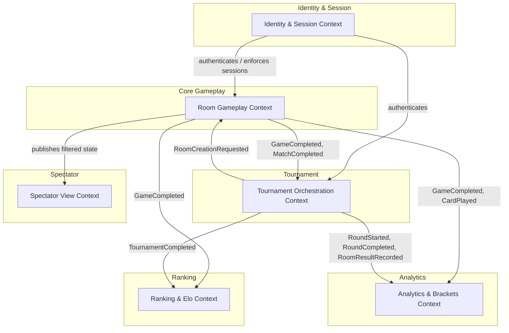

# UnoArena — Domain Model (DDD)

> **Scope:** Behavior-complete domain model for a global real-time Uno platform supporting ad-hoc rooms (2–10 players) and million-player elimination tournaments.  
> **Methodology:** EventStorming-driven Domain-Driven Design.  
> **Constraint:** The design package below is domain-only (no infrastructure or protocol internals). The solution architecture that builds on it lives under [Architecture](#architecture); deltas are tracked in [`CHANGELOG-design.md`](./CHANGELOG-design.md).

---

## Start here — final delivery

This repository holds the design, the architecture **and the running system**. The whole thing comes
up from an empty Kubernetes cluster with one command, and the ten services are independently built,
tested and digest-pinned. If you are reading this to evaluate the final delivery:

| To see | Go to |
|---|---|
| **What the system does and how it is decomposed** | [Architecture](#architecture) and [`docs/architecture/`](./docs/architecture/) |
| **How to bring it up from an empty cluster** | [`gitops/bootstrap/install.sh`](./gitops/bootstrap/) — one command, kind or EKS |
| **How to drive it through the Client CLI** | [Driving it through the Client CLI](#driving-it-through-the-client-cli) — every canonical command mapped to its backend operation |
| **The observability, and the three business metrics** | [`docs/observability-runbook.md`](./docs/observability-runbook.md) |
| **The delivery pipeline** | [`devops-checkpoint/README.md`](./devops-checkpoint/README.md) |
| **Every place the running system differs from the design, and why** | [`CHANGELOG-design.md`](./CHANGELOG-design.md) |
| **How the live demo is run, timed, and degraded if something fails** | [`docs/demo-runbook.md`](./docs/demo-runbook.md) |

Measured, not estimated: an empty EKS cluster reaches **24 of 24 Argo applications Synced/Healthy in
8 minutes 53 seconds**, one `correlationId` returns log lines from **five services** in a single
query, and the widest pipeline run is **44 jobs**. Where a number appears in this repository, the
rehearsal that produced it is named next to it.

---

## Deliverables

| # | Document | Description |
|---|----------|-------------|
| 1 | [Domain Glossary](./docs/design/01-domain-glossary.md) | Ubiquitous language with precise definitions |
| 2 | [Bounded Contexts & Context Map](./docs/design/02-bounded-contexts.md) | Context boundaries, relationships, and the Spectator View treatment |
| 3 | [Aggregates, Entities & Value Objects](./docs/design/03-aggregates.md) | Candidate aggregates, consistency boundaries, and key invariants |
| 4 | [Commands & Domain Events Catalog](./docs/design/04-commands-events.md) | Core commands, resulting events, causality, and idempotency |
| 5 | [Domain Event Flow Narratives](./docs/design/05-event-flow-narratives.md) | End-to-end event sequences for key business flows |
| 6 | [Edge Cases & Failure-Path Analysis](./docs/design/06-edge-cases.md) | Concurrent conflicts, disconnections, stale commands, security abuse |
| 7 | [Consistency & Recovery Strategy](./docs/design/07-consistency-recovery.md) | Retries, deduplication, compensation/saga decisions at the domain level |
| 8 | [Open Questions & Assumptions](./docs/design/08-open-questions.md) | Validated requirements vs. assumptions, connection-semantics assumptions |

---

## Architecture

The solution architecture (Architecture Checkpoint) builds on and is traceable to the design package above.

| # | Document | Description |
|---|----------|-------------|
| 6.1 | [Service Architecture](./docs/architecture/01-service-architecture.md) | Per-bounded-context services, interfaces, persistence, mandatory mechanisms (log-before-broadcast, durable timers, session kill, first-round surge, spectator projection, match-series, abandoned-vs-completed), C4 + sequence diagrams |
| 6.2 | [Design Alignment Changelog](./CHANGELOG-design.md) | Architecture-driven deltas to the design package, traceability, and non-negotiable affirmations |
| 6.3 | [Communication Patterns](./docs/architecture/02-communication-patterns.md) | Client connection model (REST + SSE), multi-layer rate limiting mapped to deployables, full integration table (sync, async, pub/sub, saga, timers, session kill) |
| 6.4 | [Persistence Layer](./docs/architecture/03-persistence-layer.md) | Per-context data stores, consistency models, transactional boundaries, read models, retention/audit, log-before-broadcast transaction design, game log audit read path |
| 6.5 | [Capacity Sketch](./docs/architecture/04-capacity-sketch.md) | Order-of-magnitude reasoning: peak concurrent entities, event/command rates, per-component scaling, first-round surge timeline, spectator multiplier, infrastructure summary |
| — | [Observability & Health](./docs/architecture/05-observability-and-health.md) | Structured logging, metrics per service, correlation/tracing, liveness/readiness endpoints, tournament round health dashboard (strongly recommended §7) |
| 7.1 | [NFR Matrix](./docs/architecture/06-nfr-matrix.md) | Latency budgets, throughput targets, availability goals, data consistency SLOs, scalability limits, flow-to-NFR traceability (strongly recommended §7) |
| 7.2 | [Threat Model](./docs/architecture/07-threat-model.md) | Lightweight STRIDE analysis: spoofing, tampering, repudiation, information disclosure, DoS, elevation of privilege; trust boundaries, risk summary (strongly recommended §7) |
| 7.3 | [Architecture Decision Records](./docs/architecture/08-adrs.md) | ADRs for top 10 choices: event sourcing, transactional outbox, REST+SSE, Kafka, API Gateway, choreographed saga, durable timers, per-context DB, separate Spectator View, CloudEvents (strongly recommended §7) |
| 7.4 | [Local & Test Topology](./docs/architecture/09-local-topology.md) | Docker Compose sketch with network isolation, service dependencies, health checks, differences from production (optional enrichment §7) |
| 7.5 | [API & Event Catalog](./docs/architecture/10-api-event-catalog.md) | OpenAPI fragments for critical REST endpoints, AsyncAPI outline for Kafka events, traceability to design command/event catalog (optional enrichment §7) |
| 7.6 | [Data Migration & Versioning](./docs/architecture/11-data-migration.md) | Event schema versioning (additive-only + upcasting), REST API versioning, DB migration principles, Kafka topic configuration (optional enrichment §7) |

---

## EventStorming Legend

Throughout the documents we use the following color-coding convention (rendered as labels):

- **🟠 Domain Event** — something that happened (past tense)
- **🔵 Command** — an intention to change state
- **🟡 Policy / Reactor** — automated reaction ("when X happens, do Y")
- **🟣 Aggregate** — consistency boundary that accepts commands and emits events
- **🔴 Hot Spot / Open Question** — unresolved issue or risk
- **🟢 Read Model** — query-optimized projection

---

## EventStorming Big-Picture Board

The following board summarizes the main business flows, exceptional paths, cross-context event propagation, and key policies discovered through EventStorming sessions. Colors follow the legend above.

```
═══════════════════════════════════════════════════════════════════════════════════════════
  ROOM LIFECYCLE (Room Gameplay Context)                          TOURNAMENT LIFECYCLE
═══════════════════════════════════════════════════════════════════════════════════════════

🔵 CreateRoom          🔵 JoinRoom           🔵 StartGame              🔵 CreateTournament
     │                      │                      │                        │
     ▼                      ▼                      ▼                        ▼
🟠 RoomCreated         🟠 PlayerJoined        🟠 GameStarted          🟠 TournamentCreated
     │                                             │
     └──► 🟢 SpectatorRoomView                     ├── 🟡 First Card Rule applied
                                                   │      (action card effect if applicable)
                                                   ▼
                                          ┌─────────────────┐
                                          │  GAMEPLAY LOOP   │
                                          └─────────────────┘
                                                   │
          🔵 PlayCard ◄────────────────────────────┤
               │                                   │
               ▼                                   │
          🟠 CardPlayed ──┬── 🟠 DirectionReversed │       🔵 RegisterPlayer
               │          ├── 🟠 ForcedDraw        │            │
               │          ├── 🟠 TurnSkipped       │            ▼
               │          └── 🟠 UnoCallMade       │       🟠 PlayerRegistered
               │                    │              │
               │                    ▼              │       🔵 StartTournament
               │          🟠 ChallengeWindowOpened │            │
               │                    │              │            ▼
               │           🟡 5s timer             │       🟠 TournamentStarted
               │                    │              │            │
               │                    ▼              │            ▼
               │          🟠 ChallengeWindowClosed │       🟠 RoundStarted
               │                                   │            │
          ┌────┴─── player has 0 cards? ──────┐    │            ▼
          │ No: loop continues                │    │       🟠 RoomCreationRequested
          │ Yes:                               ▼    │       (×N rooms, to Room Gameplay)
          │                              🟠 GameCompleted
          │                                   │
          │              ┌────────────────────┤
          │              │                    │
          │         Casual room          Tournament room
          │              │                    │
          │              ▼                    ▼
          │    🟠 RoomCompleted         🟡 More games?
          │         │                   │          │
          │         ▼                  Yes         No
          │    🟡 UpdateElo             │          │
          │         │               🔵 StartGame  ▼
          │         ▼               (next game)  🟠 MatchCompleted
          │    🟠 EloUpdated                      │
          │    (Ranking ctx)                      ▼
          │                                 🟠 RoomCompleted
          │                                      │
          │                                      ▼
          │                                 🟡 RecordRoomResult
          │                                      │
          │                                      ▼
          │                                 🟠 RoomResultRecorded
          │                                      │
          │                                 🟡 All rooms done?
          │                                 │              │
          │                                 No             Yes
          │                                 │              │
          │                                (wait)          ▼
          │                                          🟠 RoundCompleted
          │                                               │
          │                                          🟡 ≤10 players?
          │                                          │            │
          │                                         No           Yes
          │                                          │            │
          │                                          ▼            ▼
          │                                    🟠 RoundStarted  🟠 FinalRoomCreated
          │                                    (next round)          │
          │                                                          ▼
          │                                                    🟠 TournamentCompleted
          │                                                          │
          │                                                          ▼
          │                                                    🟡 UpdateTournamentPlacement
          │                                                          │
          │                                                          ▼
          │                                                    🟠 TournamentPlacementUpdated
          │                                                    (Ranking ctx)
          │
═══════════════════════════════════════════════════════════════════════════════════════════
  EXCEPTIONAL / FAILURE FLOWS
═══════════════════════════════════════════════════════════════════════════════════════════
          │
          ├── 🔴 Player disconnects
          │        🟠 PlayerDisconnected → 🟡 60s timer
          │        │    On each turn: 🟠 TurnSkipped { reason: disconnection }
          │        │    Timer expires: 🔵 ForfeitPlayer → 🟠 PlayerForfeited
          │        │    Reconnects in time: 🔵 ReconnectPlayer → 🟠 PlayerReconnected
          │
          ├── 🔴 Turn timer expires (connected but inactive)
          │        🟠 TurnTimedOut → 🟡 Auto-draw + pass
          │
          ├── 🔴 Stale command (wrong seq)
          │        → stale state-mutating request rejected; client reconciles
          │          current state via SSE and retries (HTTP mapping: stale
          │          sequence → 412 Precondition Failed, see Architecture §2.3.1)
          │
          ├── 🔴 Session invalidated (new login)
          │        🟠 SessionInvalidated → treated as disconnection in Room Gameplay
          │
          ├── 🔴 Room creation fails (tournament)
          │        🟠 RoomCreationFailed → 🟡 Tournament retries or alerts operator
          │
          └── 🔴 Rate limit exceeded
                   🟠 RateLimitExceeded → HTTP 429 + adaptive throttling
```

---

## High-Level Domain Map (Mermaid)



---

## Running the system

The design and architecture above are the *what*; these are the entry points for the *running*
system. The final-delivery program that builds it phase by phase lives in
[`specs/2026-07-26-final-delivery-northstar/`](./specs/2026-07-26-final-delivery-northstar/).

| Entry point | What it does |
|---|---|
| [`gitops/bootstrap/install.sh`](./gitops/bootstrap/) | One command from an empty Kubernetes cluster to the whole platform (Kafka, Postgres, Redis, Prometheus/Grafana) plus the services, via Argo CD. Works against kind or a freshly created EKS cluster. |
| [`clients/cli/`](./clients/cli/) | The Client CLI — the command surface the teaching staff uses to drive the backend. Every canonical command, the endpoint it maps to, the seeding procedure and the gaps we chose not to fill are documented there. |
| [`gitops/secrets/`](./gitops/secrets/) | How secrets reach a cluster that has never existed before, with no plaintext in the repo. |
| [`devops-checkpoint/README.md`](./devops-checkpoint/README.md) | The delivery pipeline: stages, change detection, promotion by digest, drills and their evidence. |
| [`services/room-gameplay/engine/`](./services/room-gameplay/engine/) | The Uno rules, as a module with no framework on its classpath: `decide(state, command)` and `evolve(state, event)`. The property suites run thousands of generated games with no database and no container. |
| [`services/gateway/`](./services/gateway/) | The only way in: the route table, HS256 validation, the header whitelist that makes the trust boundary real, and `GET /rooms/{id}/stream` — Server-Sent Events whose frame ids *are* the events' sequence numbers, so a client resumes with `Last-Event-ID` and can prove it missed nothing. |
| [`docs/observability-runbook.md`](./docs/observability-runbook.md) | The three dashboards and what each answers, the Grafana URL and where its credential lives, the one LogQL query that follows a request across the system, how to fire an alert on purpose, and the handful of readings that look like faults and are not. |
| [`CHANGELOG-design.md`](./CHANGELOG-design.md) | Every place the running system differs from the design and architecture documents, with the reason. Nothing is quietly corrected in place. |
| [`docs/demo-runbook.md`](./docs/demo-runbook.md) | The exam script: the 48h checklist, the timed sequence from an empty cluster, where the narration goes so a counter is never read mid-flight, and a degrade branch for every step that can fail. |
| [`presentation/`](./presentation/) | The final deck — architecture and the decisions worth defending. |

## Driving it through the Client CLI

`Client-Checkpoint.md` §9 asks this README to carry the whole canonical command surface, each
command's backend mapping, the seeding procedure, the tournament threshold, and any gap. The CLI's
own [`README`](./clients/cli/README.md) has the detail; this is the map.

**Invocation.** Native: `cd clients/cli && npm install && npm run build`, then
`node dist/cli.js <command>`. Docker: `docker build -t unoarena-cli clients/cli` then
`docker run --rm -e UNOARENA_API_URL=http://<host>:30080 unoarena-cli <command>`. The only
configuration is `UNOARENA_API_URL` (the gateway — never hardcoded), plus optional
`UNOARENA_SESSION` (one session file = one player identity) and `UNOARENA_POLL_MS`.

| § | Command | Backend operation |
|---|---|---|
| 5.A | `register` / `login` | `POST /auth/register` · `POST /auth/login` → `identity` |
| 5.A | `whoami` / `logout` | `GET /auth/whoami` · `POST /auth/logout` |
| 5.A | `seed --count N [--prefix P]` | `POST /auth/register`, falling back to `/auth/login` per account |
| 5.B | `room create [--max N]` | `POST /rooms` (with an `Idempotency-Key`) → `room-gameplay` |
| 5.B | `room list` / `room join <id>` / `room leave [<id>]` | `GET /rooms` · `POST /rooms/{id}/players/{me}` · `DELETE /rooms/{id}/players/{me}` |
| 5.B/5.C | `play --casual` / `play --room <id>` | list → join → else create, then `GET /rooms/{id}/stream` (SSE) + `GET /rooms/{id}/games/{n}` |
| 5.C | `play <n>` / `draw` / `pass` / `uno` / `challenge` / `state` / `quit` | `POST /rooms/{id}/games/{n}/moves` (`state` re-reads, `quit` is local) |
| 5.D | `spectate <roomId>` | `GET /rooms/{id}/spectate` (SSE) → `spectator` |
| 5.E | `bot [--casual \| --room <id> \| --tournament [<id>]]` | the same surfaces, played by a seeded RNG |
| 5.E | `tournament register [<id>]` / `status [<id>]` | `POST /tournaments` · `POST /tournaments/{id}/register` · `GET /tournaments/{id}` → `tournament` |
| — | `tournament bracket [<id>]` | `GET /tournaments/{id}/bracket` → `analytics` (a read model, not §5) |

**Seeding test accounts (§5.A).** `node dist/cli.js seed --count 8 --prefix load --json` ensures N
accounts exist and prints credentials and tokens as JSON lines. It is safe to re-run: an account
that already exists is logged in rather than reported as a failure, so the same command always
yields N usable identities.

**Tournament test threshold (§5.E).** Configurable and deliberately low.
`TOURNAMENT_MIN_PLAYERS=4`, `TOURNAMENT_ROOM_SIZE=2`, `TOURNAMENT_ADVANCE_COUNT=1` in
`gitops/apps/tournament/overlays/staging/values.yaml` — four `tournament register` processes are a
whole event, and the bracket is best-of-three matches between pairs.

**External IdP (§5.A).** Not applicable: authentication is not delegated. `identity` is ours —
accounts, password hashing, single-active-session and the JWTs the gateway validates — so
`register`/`seed` run against the real thing and there is no stub to describe.

**Gaps, stated rather than left to be discovered (§8).** Every canonical command in §5 is
implemented. What is *not* here: no external-IdP path (above); `--tournament` on `bot` registers
and plays but does not create an event with a custom size; and the read-model commands `rating`,
`leaderboard` and `stats` are extensions beyond §5 rather than part of it. Seven of the nine alert
rules have never been observed firing and are documented as untested, and there is no tracing
backend — both recorded in `specs/2026-08-18-p8-observability/ESTADO-FINAL.md`.

**What is real — all ten deployables.** `gateway` (the single entry point: token
validation, routing and the SSE tier), `identity` (accounts, single-active-session, JWTs),
`room-gameplay` (the event-sourced Uno core: rooms, moves, the immutable game log and its
transactional outbox), `outbox-relay` (that outbox drained to Kafka as CloudEvents, at-least-once
and in per-room order), `timer-worker` (the clock behind the durable deadlines), `ranking` (Elo over
finished casual games, with the per-game history that makes a rating auditable), `spectator` (a
privacy-filtered projection of a live room, fanned out as its own SSE), and `analytics-workers` +
`analytics-api` (three CQRS read models and the read-only API over them). Two players can register
through the CLI and play a casual game to the end against a cluster deployed from empty — over
**one** URL, with each move pushed to the other player rather than polled for, and a `bot --casual`
able to take either seat headless. A game now also *finishes* without them: a player who stops
answering loses the seat after three lapsed turns, and a room nobody joined closes on the clock.
When it ends, two ratings move and three projections update.

**And tournaments run.** `tournament` is the tenth service and the last placeholder to go: four
players register through the CLI with one command each, a low configurable threshold starts the
event, and it plays itself out — rooms provisioned round by round, best-of-three matches decided by
the room that hosted them, survivors reseeded, a final, a champion. The bracket is readable from
analytics, and finishing moves a *placement* rating that never touches Elo, because Elo is
casual-only by design and now enforced in both directions. Nothing in the repo carries
`digest: ""` any more.

**A stranger can watch, and sees no hand.** `spectate <roomId>` streams a room's public state to any
logged-in player who is not sitting at the table. The boundary is not a filter added at the edge:
`publicPayload` strips the RNG seed inside room-gameplay, in the same transaction that writes the
event, so by the time anything reaches Kafka the deck is already gone — and the spectator's view
type has no field that could hold a hand. `grep -c seed` over both topics, over the spectator's SSE
frames and over the CLI's output returns **0**.

**One door.** Everything from outside enters through the gateway on `30080`; identity and
room-gameplay are `ClusterIP` and unreachable from off-cluster. room-gameplay holds no signing key
at all — it trusts `X-Player-Id` / `X-Session-Id`, which the gateway builds from the validated token
and overwrites on every request, so a client cannot supply its own.

**The log is the authority.** Every accepted move is appended to `room_events` *before* anyone
sees the result, in the same transaction as the outbox rows a consumer will later read. If a
rebuilt aggregate ever disagrees with the state that was served, the log wins and the bug is in
the code.

**And all of it is visible.** The same install that brings the system up brings up its
observability: Prometheus scrapes eleven targets (ten services — the outbox relay runs twice), and
Grafana answers on `30081` with three dashboards built from committed JSON. The business board
carries the exam's three metrics — games completed, tournaments completed, players registered —
each counted from a **committed domain event** rather than from the request that appeared to cause
it, so a game that ends by forfeit still counts. Nine alert rules cover failures this project has
actually had, and Loki holds the logs: one `correlationId`, printed by the CLI, returns the gateway
that routed a command, the aggregate that owned it and all three read models that projected the
event it produced — **five services in one query**. The runbook above is the operational half.
