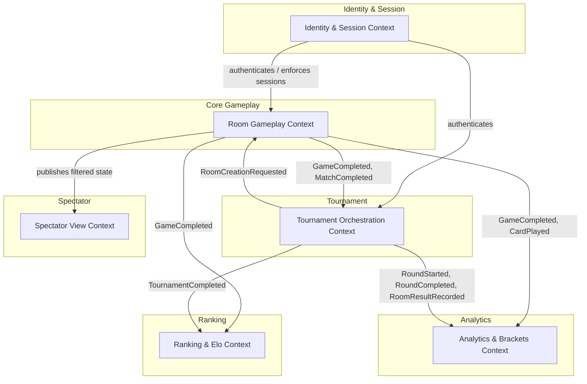

# UnoArena — Domain Model (DDD)

> **Scope:** Behavior-complete domain model for a global real-time Uno platform supporting ad-hoc rooms (2–10 players) and million-player elimination tournaments.  
> **Methodology:** EventStorming-driven Domain-Driven Design.  
> **Constraint:** The design package below is domain-only (no infrastructure or protocol internals). The solution architecture that builds on it lives under [Architecture](#architecture); deltas are tracked in [`CHANGELOG-design.md`](./CHANGELOG-design.md).

---

## Deliverables

| # | Document | Description |
|---|----------|-------------|
| 1 | [Domain Glossary](./docs/design/01-domain-glossary.md) | Ubiquitous language with precise definitions |
| 2 | [Bounded Contexts & Context Map](./docs/design/02-bounded-contexts.md) | Context boundaries, relationships, and the Spectator View treatment |
| 3 | [Aggregates, Entities & Value Objects](./docs/design/03-aggregates.md) | Candidate aggregates, consistency boundaries, and key invariants |
| 4 | [Commands & Domain Events Catalog](./docs/design/04-commands-events.md) | Core commands, resulting events, causality, and idempotency |
| 5 | [Domain Event Flow Narratives](./docs/design/05-event-flow-narratives.md) | End-to-end event sequences for key business flows |
| 6 | [Edge Cases & Failure-Path Analysis](./docs/design/06-edge-cases.md) | Concurrent conflicts, disconnections, stale commands, security abuse |
| 7 | [Consistency & Recovery Strategy](./docs/design/07-consistency-recovery.md) | Retries, deduplication, compensation/saga decisions at the domain level |
| 8 | [Open Questions & Assumptions](./docs/design/08-open-questions.md) | Validated requirements vs. assumptions, connection-semantics assumptions |

---

## Architecture

The solution architecture (Architecture Checkpoint) builds on and is traceable to the design package above.

| # | Document | Description |
|---|----------|-------------|
| 6.1 | [Service Architecture](./docs/architecture/01-service-architecture.md) | Per-bounded-context services, interfaces, persistence, mandatory mechanisms (log-before-broadcast, durable timers, session kill, first-round surge, spectator projection, match-series, abandoned-vs-completed), C4 + sequence diagrams |
| 6.2 | [Design Alignment Changelog](./CHANGELOG-design.md) | Architecture-driven deltas to the design package, traceability, and non-negotiable affirmations |
| 6.3 | [Communication Patterns](./docs/architecture/02-communication-patterns.md) | Client connection model (REST + SSE), multi-layer rate limiting mapped to deployables, full integration table (sync, async, pub/sub, saga, timers, session kill) |
| 6.4 | [Persistence Layer](./docs/architecture/03-persistence-layer.md) | Per-context data stores, consistency models, transactional boundaries, read models, retention/audit, log-before-broadcast transaction design, game log audit read path |
| 6.5 | [Capacity Sketch](./docs/architecture/04-capacity-sketch.md) | Order-of-magnitude reasoning: peak concurrent entities, event/command rates, per-component scaling, first-round surge timeline, spectator multiplier, infrastructure summary |
| — | [Observability & Health](./docs/architecture/05-observability-and-health.md) | Structured logging, metrics per service, correlation/tracing, liveness/readiness endpoints, tournament round health dashboard (strongly recommended §7) |
| 7.1 | [NFR Matrix](./docs/architecture/06-nfr-matrix.md) | Latency budgets, throughput targets, availability goals, data consistency SLOs, scalability limits, flow-to-NFR traceability (strongly recommended §7) |
| 7.2 | [Threat Model](./docs/architecture/07-threat-model.md) | Lightweight STRIDE analysis: spoofing, tampering, repudiation, information disclosure, DoS, elevation of privilege; trust boundaries, risk summary (strongly recommended §7) |
| 7.3 | [Architecture Decision Records](./docs/architecture/08-adrs.md) | ADRs for top 10 choices: event sourcing, transactional outbox, REST+SSE, Kafka, API Gateway, choreographed saga, durable timers, per-context DB, separate Spectator View, CloudEvents (strongly recommended §7) |
| 7.4 | [Local & Test Topology](./docs/architecture/09-local-topology.md) | Docker Compose sketch with network isolation, service dependencies, health checks, differences from production (optional enrichment §7) |
| 7.5 | [API & Event Catalog](./docs/architecture/10-api-event-catalog.md) | OpenAPI fragments for critical REST endpoints, AsyncAPI outline for Kafka events, traceability to design command/event catalog (optional enrichment §7) |
| 7.6 | [Data Migration & Versioning](./docs/architecture/11-data-migration.md) | Event schema versioning (additive-only + upcasting), REST API versioning, DB migration principles, Kafka topic configuration (optional enrichment §7) |

---

## EventStorming Legend

Throughout the documents we use the following color-coding convention (rendered as labels):

- **🟠 Domain Event** — something that happened (past tense)
- **🔵 Command** — an intention to change state
- **🟡 Policy / Reactor** — automated reaction ("when X happens, do Y")
- **🟣 Aggregate** — consistency boundary that accepts commands and emits events
- **🔴 Hot Spot / Open Question** — unresolved issue or risk
- **🟢 Read Model** — query-optimized projection

---

## EventStorming Big-Picture Board

The following board summarizes the main business flows, exceptional paths, cross-context event propagation, and key policies discovered through EventStorming sessions. Colors follow the legend above.

```
═══════════════════════════════════════════════════════════════════════════════════════════
  ROOM LIFECYCLE (Room Gameplay Context)                          TOURNAMENT LIFECYCLE
═══════════════════════════════════════════════════════════════════════════════════════════

🔵 CreateRoom          🔵 JoinRoom           🔵 StartGame              🔵 CreateTournament
     │                      │                      │                        │
     ▼                      ▼                      ▼                        ▼
🟠 RoomCreated         🟠 PlayerJoined        🟠 GameStarted          🟠 TournamentCreated
     │                                             │
     └──► 🟢 SpectatorRoomView                     ├── 🟡 First Card Rule applied
                                                   │      (action card effect if applicable)
                                                   ▼
                                          ┌─────────────────┐
                                          │  GAMEPLAY LOOP   │
                                          └─────────────────┘
                                                   │
          🔵 PlayCard ◄────────────────────────────┤
               │                                   │
               ▼                                   │
          🟠 CardPlayed ──┬── 🟠 DirectionReversed │       🔵 RegisterPlayer
               │          ├── 🟠 ForcedDraw        │            │
               │          ├── 🟠 TurnSkipped       │            ▼
               │          └── 🟠 UnoCallMade       │       🟠 PlayerRegistered
               │                    │              │
               │                    ▼              │       🔵 StartTournament
               │          🟠 ChallengeWindowOpened │            │
               │                    │              │            ▼
               │           🟡 5s timer             │       🟠 TournamentStarted
               │                    │              │            │
               │                    ▼              │            ▼
               │          🟠 ChallengeWindowClosed │       🟠 RoundStarted
               │                                   │            │
          ┌────┴─── player has 0 cards? ──────┐    │            ▼
          │ No: loop continues                │    │       🟠 RoomCreationRequested
          │ Yes:                               ▼    │       (×N rooms, to Room Gameplay)
          │                              🟠 GameCompleted
          │                                   │
          │              ┌────────────────────┤
          │              │                    │
          │         Casual room          Tournament room
          │              │                    │
          │              ▼                    ▼
          │    🟠 RoomCompleted         🟡 More games?
          │         │                   │          │
          │         ▼                  Yes         No
          │    🟡 UpdateElo             │          │
          │         │               🔵 StartGame  ▼
          │         ▼               (next game)  🟠 MatchCompleted
          │    🟠 EloUpdated                      │
          │    (Ranking ctx)                      ▼
          │                                 🟠 RoomCompleted
          │                                      │
          │                                      ▼
          │                                 🟡 RecordRoomResult
          │                                      │
          │                                      ▼
          │                                 🟠 RoomResultRecorded
          │                                      │
          │                                 🟡 All rooms done?
          │                                 │              │
          │                                 No             Yes
          │                                 │              │
          │                                (wait)          ▼
          │                                          🟠 RoundCompleted
          │                                               │
          │                                          🟡 ≤10 players?
          │                                          │            │
          │                                         No           Yes
          │                                          │            │
          │                                          ▼            ▼
          │                                    🟠 RoundStarted  🟠 FinalRoomCreated
          │                                    (next round)          │
          │                                                          ▼
          │                                                    🟠 TournamentCompleted
          │                                                          │
          │                                                          ▼
          │                                                    🟡 UpdateTournamentPlacement
          │                                                          │
          │                                                          ▼
          │                                                    🟠 TournamentPlacementUpdated
          │                                                    (Ranking ctx)
          │
═══════════════════════════════════════════════════════════════════════════════════════════
  EXCEPTIONAL / FAILURE FLOWS
═══════════════════════════════════════════════════════════════════════════════════════════
          │
          ├── 🔴 Player disconnects
          │        🟠 PlayerDisconnected → 🟡 60s timer
          │        │    On each turn: 🟠 TurnSkipped { reason: disconnection }
          │        │    Timer expires: 🔵 ForfeitPlayer → 🟠 PlayerForfeited
          │        │    Reconnects in time: 🔵 ReconnectPlayer → 🟠 PlayerReconnected
          │
          ├── 🔴 Turn timer expires (connected but inactive)
          │        🟠 TurnTimedOut → 🟡 Auto-draw + pass
          │
          ├── 🔴 Stale command (wrong seq)
          │        → stale state-mutating request rejected; client reconciles
          │          current state via SSE and retries (HTTP mapping: stale
          │          sequence → 412 Precondition Failed, see Architecture §2.3.1)
          │
          ├── 🔴 Session invalidated (new login)
          │        🟠 SessionInvalidated → treated as disconnection in Room Gameplay
          │
          ├── 🔴 Room creation fails (tournament)
          │        🟠 RoomCreationFailed → 🟡 Tournament retries or alerts operator
          │
          └── 🔴 Rate limit exceeded
                   🟠 RateLimitExceeded → HTTP 429 + adaptive throttling
```

---

## High-Level Domain Map (Mermaid)



---

## Running the system

The design and architecture above are the *what*; these are the entry points for the *running*
system. The final-delivery program that builds it phase by phase lives in
[`specs/2026-07-26-final-delivery-northstar/`](./specs/2026-07-26-final-delivery-northstar/).

| Entry point | What it does |
|---|---|
| [`gitops/bootstrap/install.sh`](./gitops/bootstrap/) | One command from an empty Kubernetes cluster to the whole platform (Kafka, Postgres, Redis, Prometheus/Grafana) plus the services, via Argo CD. Works against kind or a freshly created EKS cluster. |
| [`clients/cli/`](./clients/cli/) | The Client CLI — the command surface the teaching staff uses to drive the backend. Every canonical command, the endpoint it maps to, the seeding procedure and the gaps we chose not to fill are documented there. |
| [`gitops/secrets/`](./gitops/secrets/) | How secrets reach a cluster that has never existed before, with no plaintext in the repo. |
| [`devops-checkpoint/README.md`](./devops-checkpoint/README.md) | The delivery pipeline: stages, change detection, promotion by digest, drills and their evidence. |
| [`services/room-gameplay/engine/`](./services/room-gameplay/engine/) | The Uno rules, as a module with no framework on its classpath: `decide(state, command)` and `evolve(state, event)`. The property suites run thousands of generated games with no database and no container. |
| [`CHANGELOG-design.md`](./CHANGELOG-design.md) | Every place the running system differs from the design and architecture documents, with the reason. Nothing is quietly corrected in place. |

**What is real so far.** `identity` (accounts, single-active-session, JWTs) and `room-gameplay`
(the event-sourced Uno core: rooms, moves, the immutable game log and its transactional outbox).
Two players can register through the CLI and play a casual game to the end against a cluster
deployed from empty. The gateway, SSE, the outbox relay, tournaments, Elo and the spectator view
are still placeholders — their phases are P4–P7 in the roadmap.

**The log is the authority.** Every accepted move is appended to `room_events` *before* anyone
sees the result, in the same transaction as the outbox rows a consumer will later read. If a
rebuilt aggregate ever disagrees with the state that was served, the log wins and the bug is in
the code.
