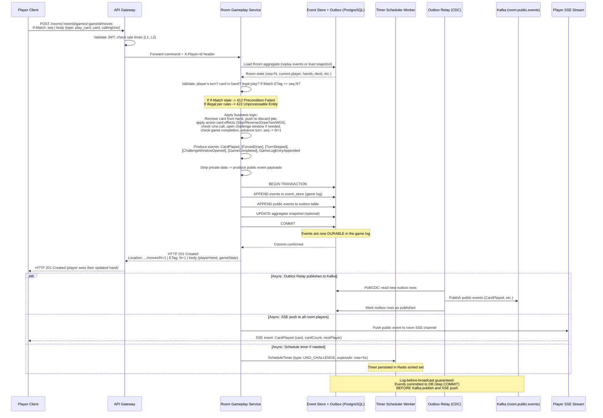
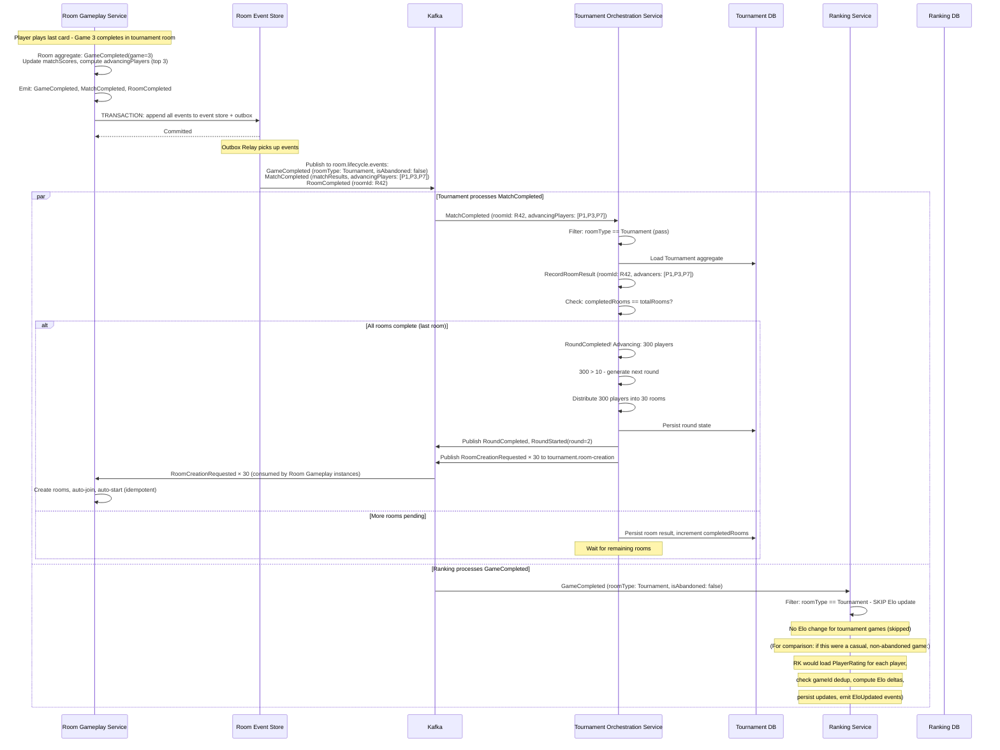
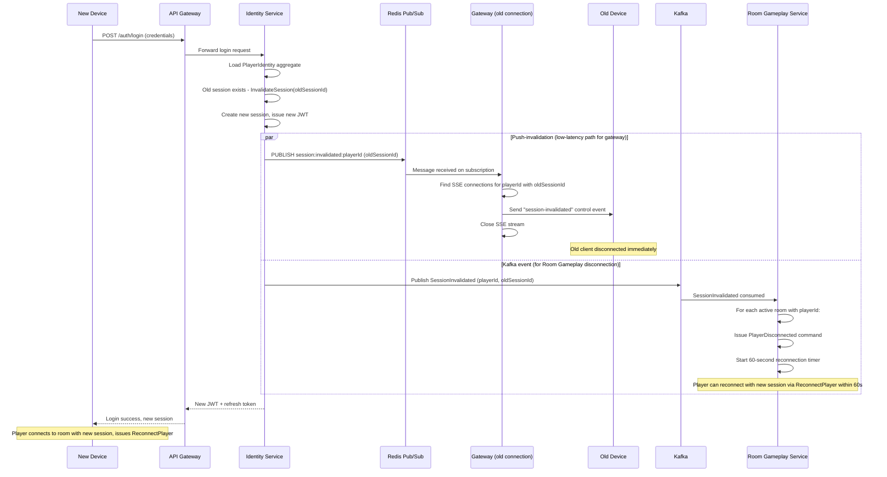

# 6.1 — Architecture of Every Bounded Context

> For each bounded context from the Design Checkpoint, this document specifies deployable services, public interfaces, persistence, inter-context dependencies, and the mandatory architectural mechanisms (log-before-broadcast, durable timers, session kill, tournament surge, spectator projection, match series coordination, and abandoned-vs-completed game distinction).

---

## Table of Contents

1. [System-Level Container Diagram](#1-system-level-container-diagram)
2. [Room Gameplay Context](#2-room-gameplay-context)
3. [Tournament Orchestration Context](#3-tournament-orchestration-context)
4. [Ranking & Elo Context](#4-ranking--elo-context)
5. [Identity & Session Context](#5-identity--session-context)
6. [Spectator View Context](#6-spectator-view-context)
7. [Analytics & Brackets Context](#7-analytics--brackets-context)
8. [Mandatory Sequence Diagrams](#8-mandatory-sequence-diagrams)

---

## 1. System-Level Container Diagram

```mermaid
C4Context
    title UnoArena - Container Diagram (C4 Level 2)

    Person(player, "Player", "Plays Uno via web/mobile client")
    Person(spectator, "Spectator", "Watches games in real time")
    Person(admin, "Admin", "Manages tournaments, reviews audits")

    System_Boundary(platform, "UnoArena Platform") {

        Container(gateway, "API Gateway / BFF", "Nginx + custom BFF", "TLS termination, JWT validation, rate limiting (per-IP), SSE long-lived streams, session-kill listener")

        Container(identity_svc, "Identity & Session Service", "Node.js / Go", "Authentication, single-active-session, token issuance, per-user rate limiting")

        Container(room_svc, "Room Gameplay Service", "Java / Kotlin (event-sourced)", "Authoritative game state, command processing, log-before-broadcast, RNG, timers")

        Container(timer_svc, "Timer Scheduler Worker", "Go sidecar / embedded", "Durable delayed-delivery for 5s Uno challenge, 30s turn, 60s reconnection timers")

        Container(tournament_svc, "Tournament Orchestration Service", "Java / Kotlin", "Tournament lifecycle, round generation, room fan-out, advancement")

        Container(tournament_worker, "Round Kickoff Workers", "Stateless workers ×N", "Sharded fan-out of RoomCreationRequested during first-round surge")

        Container(ranking_svc, "Ranking & Elo Service", "Python / Go", "Elo computation, placement rating, deduplication")

        Container(spectator_svc, "Spectator View Service", "Node.js", "Privacy-filtered read model, SSE fan-out to spectators")

        Container(analytics_svc, "Analytics & Brackets Service", "Python / Go", "Bracket projections, player stats, tournament leaderboards")

        ContainerDb(room_es, "Room Event Store", "PostgreSQL / EventStoreDB", "Append-only game log + outbox table per room")
        ContainerDb(tournament_db, "Tournament DB", "PostgreSQL", "Tournament aggregates, round state, room refs")
        ContainerDb(ranking_db, "Ranking DB", "PostgreSQL", "PlayerRating aggregates, rating history")
        ContainerDb(identity_db, "Identity DB", "PostgreSQL", "Player credentials, sessions")
        ContainerDb(spectator_db, "Spectator Read Store", "Redis", "Per-room public state snapshots")
        ContainerDb(analytics_db, "Analytics Store", "ClickHouse / PostgreSQL", "Bracket views, player stats, historical data")

        ContainerQueue(broker, "Event Broker", "Apache Kafka", "Durable pub/sub, partitioned by roomId / tournamentId")
        ContainerDb(redis, "Shared Redis", "Redis", "Rate-limit counters, session-invalidation pub/sub, timer scheduling")
    }

    Rel(player, gateway, "HTTPS + SSE", "REST commands, room SSE stream")
    Rel(spectator, gateway, "HTTPS + SSE", "Spectator stream")
    Rel(admin, gateway, "HTTPS", "Tournament admin API")
    Rel(gateway, identity_svc, "gRPC (sync)", "Token validation, rate-limit check")
    Rel(gateway, room_svc, "HTTP REST (sync)", "Game commands")
    Rel(gateway, tournament_svc, "HTTP REST (sync)", "Tournament commands")
    Rel(gateway, spectator_svc, "Internal SSE relay", "Spectator subscriptions")
    Rel(room_svc, room_es, "Read/Write", "Event-sourced aggregates + outbox")
    Rel(room_svc, broker, "Publish", "Public events via outbox relay")
    Rel(room_svc, timer_svc, "Schedule/Cancel", "Durable timer requests")
    Rel(timer_svc, room_svc, "Callback", "Timer-expired commands")
    Rel(broker, tournament_svc, "Subscribe", "MatchCompleted, RoomCompleted")
    Rel(broker, ranking_svc, "Subscribe", "GameCompleted, TournamentCompleted")
    Rel(broker, spectator_svc, "Subscribe", "Public game events (filtered)")
    Rel(broker, analytics_svc, "Subscribe", "All public events")
    Rel(tournament_svc, broker, "Publish", "RoomCreationRequested, RoundStarted, etc.")
    Rel(tournament_svc, tournament_worker, "Enqueue", "Sharded room-creation batches")
    Rel(identity_svc, redis, "Read/Write", "Rate-limit counters, session pub/sub")
    Rel(identity_svc, broker, "Publish", "SessionInvalidated")
```




---

## 2. Room Gameplay Context

### 2.1 Purpose and Scope

**Owns:** Authoritative game state for every room — deck, hands, discard pile, turn order, Uno call mechanics, challenge windows, disconnection timers, match series state (best-of-3 for tournament rooms), and the immutable game log. Accepts player commands, enforces all game rules, serializes mutations via sequence numbers, and emits domain events.

**Does NOT own:** Player identity/authentication, tournament structure beyond the room's `roomType` flag, Elo calculations, spectator delivery, or bracket visualization.

### 2.2 Deployable Services


| Service                                                                     | Responsibility                                                                                                                                                                                                                                                                                                                                           |
| --------------------------------------------------------------------------- | -------------------------------------------------------------------------------------------------------------------------------------------------------------------------------------------------------------------------------------------------------------------------------------------------------------------------------------------------------- |
| **Room Gameplay Service**                                                   | Core command-processing service. Loads Room aggregate from event store, validates and applies commands, appends events to the event store + outbox atomically, returns command results to the gateway. Stateless horizontally-scaled instances; each command is routed by `roomId` hash to ensure single-writer semantics per room (partition affinity). |
| **Outbox Relay (CDC)**                                                      | Tails the outbox table (via Debezium CDC or polling) and publishes events to Kafka topics. Guarantees log-before-broadcast: events reach Kafka only after they are durably committed in the event store.                                                                                                                                                 |
| **Timer Scheduler Worker**                                                  | Manages durable delayed-delivery for domain timers. Receives "schedule timer" requests, persists deadlines in Redis (sorted set by expiry), and on expiry delivers a callback command to the Room Gameplay Service. See §2.6 for durability details.                                                                                                     |
| **Public Event Publisher** (logical component within Room Gameplay Service) | Before writing events to the public outbox, strips private data (hand contents, deck order, RNG seed) from event payloads. Produces two event categories: *internal* (full fidelity, stored in event store) and *public* (privacy-filtered, written to outbox for cross-context consumption).                                                            |


### 2.3 Public Interfaces

#### 2.3.1 Synchronous (REST API)

All endpoints require a valid JWT in the `Authorization` header. The gateway validates the JWT signature and expiry; the Room Gameplay Service trusts the gateway's `X-Player-Id` and `X-Session-Id` headers within the trust boundary.

**Resource model.** Endpoints name *resources* (nouns), not actions. Game actions are not RPC calls — they are **moves appended to an immutable, append-only collection**, which also happens to be the game log. The resource tree:

```
/rooms                                              room collection
/rooms/{roomId}                                     a room
/rooms/{roomId}/players                              membership collection
/rooms/{roomId}/players/{playerId}                   a player's membership / presence
/rooms/{roomId}/games                                game collection (best-of-3 → up to 3)
/rooms/{roomId}/games/{gameId}                       a game (state, player-scoped representation)
/rooms/{roomId}/games/{gameId}/moves                 append-only move log (THE game log)
/rooms/{roomId}/games/{gameId}/moves/{seq}           a single, immutable logged move
```


| Method   | Endpoint                                     | Maps to Command                                               | Success                                                        | Notes                                                                                                                                                                                                                                                                                                                                                                                                                                             |
| -------- | -------------------------------------------- | ------------------------------------------------------------- | -------------------------------------------------------------- | ------------------------------------------------------------------------------------------------------------------------------------------------------------------------------------------------------------------------------------------------------------------------------------------------------------------------------------------------------------------------------------------------------------------------------------------------- |
| `POST`   | `/rooms`                                     | `CreateRoom`                                                  | `201 Created` + `Location`                                     | Body: `{ roomType, maxPlayers }`. Send `Idempotency-Key` header; a replayed key returns `200 OK` with the original representation instead of creating a duplicate.                                                                                                                                                                                                                                                                                |
| `GET`    | `/rooms/{roomId}`                            | Query (room)                                                  | `200 OK`                                                       | Room metadata + lifecycle status. Safe, cacheable (`ETag`).                                                                                                                                                                                                                                                                                                                                                                                       |
| `POST`   | `/rooms/{roomId}/players/{playerId}`         | `JoinRoom`                                                    | `201 Created` (first join) / `409 Conflict` (already a member) | Join = asserting a membership resource. **Idempotent** — repeating is a no-op. `409` if the room is full or already started.                                                                                                                                                                                                                                                                                                                      |
| `DELETE` | `/rooms/{roomId}/players/{playerId}`         | `LeaveRoom` / forfeit                                         | `204 No Content`                                               | Leave the room. **Idempotent** — deleting an absent membership still returns `204`.                                                                                                                                                                                                                                                                                                                                                               |
| `PATCH`  | `/rooms/{roomId}/players/{playerId}`         | `ReconnectPlayer`                                             | `200 OK`                                                       | Partial state transition of the membership, e.g. `{ connectionStatus: "connected" }`. Requires a valid session token. Returns the player-scoped game state to rehydrate the client.                                                                                                                                                                                                                                                               |
| `POST`   | `/rooms/{roomId}/games`                      | `StartGame`                                                   | `201 Created` + `Location`                                     | Creates a game in the room. System/host-initiated; tournament rooms auto-start. `409 Conflict` if a game is already in progress.                                                                                                                                                                                                                                                                                                                  |
| `GET`    | `/rooms/{roomId}/games/{gameId}`             | Query (player view)                                           | `200 OK`                                                       | Full game state **for the requesting player** (their hand + public state). Response carries `ETag: "{sequenceNumber}"`. Used to hydrate the client on reconnect; supports conditional `If-None-Match` → `304 Not Modified`.                                                                                                                                                                                                                       |
| `POST`   | `/rooms/{roomId}/games/{gameId}/moves`       | `PlayCard`, `DrawCard`, `PassTurn`, `CallUno`, `ChallengeUno` | `201 Created` + `Location`                                     | Appends one move to the log. Body: `{ type: "play_card" | "draw_card" | "pass" | "call_uno" | "challenge_uno", ...payload }` (e.g. `play_card` carries `card`, `chosenColor?`, `callingUno`; `challenge_uno` carries `targetPlayerId`). Requires `If-Match: "{seq}"` for optimistic concurrency (see below). Response body = the resulting player-scoped state + new `ETag`; for `draw_card`, includes the drawn card (private to the requester). |
| `GET`    | `/rooms/{roomId}/games/{gameId}/moves`       | Query (audit)                                                 | `200 OK`                                                       | The immutable game log, paginated. **Restricted access**: operator role or automated replay jobs, authorized via mTLS + RBAC. Not reachable through the public gateway.                                                                                                                                                                                                                                                                           |
| `GET`    | `/rooms/{roomId}/games/{gameId}/moves/{seq}` | Query (audit)                                                 | `200 OK`                                                       | A single logged move. Immutable → long-lived caching (`Cache-Control: public, immutable`). Same restricted access as the collection.                                                                                                                                                                                                                                                                                                              |


**Idempotent creation.** `POST /rooms` is non-idempotent by verb, so duplicate-suppression uses the standard `Idempotency-Key` request header (not a body field). The server records the key→response mapping; a replay within the retention window returns the original `201` representation as `200 OK`.

#### 2.3.2 Asynchronous (Kafka Topics — Producer)


| Topic                   | Event Types                                                                                                                                                                                                                                                                                 | Partition Key | Payload Ownership                                                                                                                                                                       | Consumers                                          |
| ----------------------- | ------------------------------------------------------------------------------------------------------------------------------------------------------------------------------------------------------------------------------------------------------------------------------------------- | ------------- | --------------------------------------------------------------------------------------------------------------------------------------------------------------------------------------- | -------------------------------------------------- |
| `room.public.events`    | `CardPlayed`, `CardDrawn`, `TurnPassed`, `ForcedDraw`, `DirectionReversed`, `TurnSkipped`, `TurnTimedOut`, `UnoCallMade`, `ChallengeWindowOpened/Closed`, `UnoChallengeIssued/Resolved`, `DeckRecycled`, `PlayerDisconnected/Reconnected`, `PlayerForfeited`, `GameStarted`, `PlayerJoined` | `roomId`      | Room Gameplay (producer). Privacy-filtered: no hand contents, no deck order, no RNG seeds.                                                                                              | Spectator View, Analytics                          |
| `room.lifecycle.events` | `RoomCreated`, `GameCompleted`, `MatchCompleted`, `RoomCompleted`                                                                                                                                                                                                                           | `roomId`      | Room Gameplay (producer). `GameCompleted` includes `roomType`, `isAbandoned`, `finishingOrder`, `cardPointTotals`. `MatchCompleted` includes `matchResults` map and `advancingPlayers`. | Tournament Orchestration, Ranking & Elo, Analytics |


**Idempotency/correlation:** Every event carries `eventId` (UUID), `roomId`, `sequenceNumber`, and `correlationId` (traces the originating command). Consumers deduplicate by `eventId` or by domain key (`gameId`, `roomId` within round, etc.).

#### 2.3.3 Asynchronous (Kafka Topics — Consumer)


| Topic                      | Event Types Consumed    | Action                                                                                                                                                      |
| -------------------------- | ----------------------- | ----------------------------------------------------------------------------------------------------------------------------------------------------------- |
| `tournament.room-creation` | `RoomCreationRequested` | Creates a tournament-linked room, auto-joins assigned players, auto-starts game 1. Idempotent by `idempotencyKey = tournamentId + roundNumber + roomIndex`. |
| `identity.session-events`  | `SessionInvalidated`    | Triggers `PlayerDisconnected` for the affected player in any active room.                                                                                   |


#### 2.3.4 Internal-Only Interfaces


| Interface                                                               | Description                                                                                                                                                                               |
| ----------------------------------------------------------------------- | ----------------------------------------------------------------------------------------------------------------------------------------------------------------------------------------- |
| Timer callback endpoint (`POST /internal/rooms/{roomId}/timer-expired`) | Receives timer expiry notifications from the Timer Scheduler Worker. Carries `{ timerId, timerType, playerId?, roomId }`. Protected by internal network policy (not exposed via gateway). |
| Event store direct read                                                 | Used only by the Outbox Relay (CDC) to tail committed events. Not exposed as an API.                                                                                                      |


### 2.4 Dependencies on Other Contexts


| Upstream Context             | Relationship                | Integration                                                                                                                                         |
| ---------------------------- | --------------------------- | --------------------------------------------------------------------------------------------------------------------------------------------------- |
| **Identity & Session**       | OHS / Conformist            | Room Gameplay validates JWTs issued by Identity (conformist to token schema). Consumes `SessionInvalidated` events to trigger disconnection.        |
| **Tournament Orchestration** | Customer–Supplier (reverse) | Consumes `RoomCreationRequested` to create tournament rooms. Room Gameplay is the supplier of room creation capability; Tournament is the customer. |


| Downstream Context           | Relationship       | Integration                                                                              |
| ---------------------------- | ------------------ | ---------------------------------------------------------------------------------------- |
| **Tournament Orchestration** | Customer–Supplier  | Publishes `GameCompleted`, `MatchCompleted`, `RoomCompleted` to `room.lifecycle.events`. |
| **Spectator View**           | Published Language | Publishes privacy-filtered events to `room.public.events`.                               |
| **Ranking & Elo**            | Published Language | `GameCompleted` carries `roomType` and `isAbandoned` so Ranking can filter.              |
| **Analytics & Brackets**     | Published Language | All public events.                                                                       |


### 2.5 Log-Before-Broadcast (Mandatory Mechanism)

The assignment's hard constraint: *every authoritative state change is durably appended to the immutable game log before any broadcast to players, spectators, or downstream consumers.*

**Mechanism: Transactional Outbox with Event Sourcing.**

```
┌──────────────────────────────────────────────────────────────────┐
│  Room Gameplay Service — Command Processing                      │
│                                                                  │
│  1. Load Room aggregate from Event Store (replay events)         │
│  2. Validate command against aggregate state                     │
│  3. Produce new domain events                                    │
│  4. In a SINGLE database transaction:                            │
│     a. APPEND events to the Event Store (game log)               │
│     b. APPEND filtered public events to the Outbox table         │
│     c. UPDATE aggregate snapshot (optional, for perf)            │
│  5. Transaction COMMITs → events are durable in the game log     │
│  6. Return command result to player (HTTP response)              │
│                                                                  │
│  ── SEPARATELY (async, after commit) ──                          │
│                                                                  │
│  7. Outbox Relay (CDC/polling) reads new outbox rows             │
│  8. Publishes to Kafka topics                                    │
│  9. Marks outbox rows as published                               │
│                                                                  │
│  CRASH SAFETY:                                                   │
│  • If crash at step 6: events are committed; client may retry    │
│    (idempotent by seq number), relay will eventually publish.    │
│  • If crash at step 7–8: relay resumes from last published       │
│    offset; at-least-once delivery to Kafka.                      │
│  • At NO point can a client or downstream consumer see an        │
│    event that is NOT in the game log.                            │
└──────────────────────────────────────────────────────────────────┘
```

**Why this satisfies the constraint:** The game log append (step 4a) and the outbox write (step 4b) share the same ACID transaction. The outbox relay (step 7–8) is a separate process that only reads committed rows. A crash between commit and relay simply means a brief delay — never a state where clients saw something the log didn't capture.

**Player-facing realtime delivery:** After the HTTP response (step 6), the gateway also pushes the event to the player's **SSE** stream (see [02-communication-patterns.md §1](./02-communication-patterns.md#1-client-connection-model) — REST + SSE, not WebSocket). This push is sourced from the same committed event — either piggybacked on the HTTP response or via the player subscribing to a room-scoped SSE channel that the Outbox Relay feeds. In both cases, the event was already persisted before it reaches any client.

### 2.6 Durable Domain Timers

Three domain timers require crash-survival and idempotent expiry:


| Timer                    | Duration                  | Owner                                                                               | Scheduling                                                                                                                                             | Expiry Action                                                                                                                                                                                                                                                                                                                |
| ------------------------ | ------------------------- | ----------------------------------------------------------------------------------- | ------------------------------------------------------------------------------------------------------------------------------------------------------ | ---------------------------------------------------------------------------------------------------------------------------------------------------------------------------------------------------------------------------------------------------------------------------------------------------------------------------- |
| **Uno Challenge Window** | 5 seconds                 | Room aggregate (persisted as `ChallengeWindow.expiresAt` in event store)            | On `ChallengeWindowOpened`: Room Gameplay Service sends `ScheduleTimer { timerId, roomId, type: UNO_CHALLENGE, expiresAt }` to Timer Scheduler Worker. | Timer Scheduler delivers `POST /internal/rooms/{roomId}/timer-expired { type: UNO_CHALLENGE, timerId }`. Room Service loads aggregate, checks if window is still open (idempotency: if already closed by a challenge or next turn, the expiry is a no-op). If still open, emits `ChallengeWindowClosed { reason: timeout }`. |
| **Turn Timer**           | 30 seconds (configurable) | Room aggregate (persisted as `Game.turnTimerDeadline` in event store)               | On each turn advance: schedule timer for new current player. Cancel previous timer.                                                                    | On expiry: delivers `TurnTimedOut` command. Room Service checks if it's still that player's turn (idempotent: if player already acted, no-op). If still their turn, auto-draws + passes.                                                                                                                                     |
| **Reconnection Window**  | 60 seconds                | Room aggregate (persisted as `RoomPlayer.connectionStatus.deadline` in event store) | On `PlayerDisconnected`: schedule timer. Cancel on `PlayerReconnected`.                                                                                | On expiry: delivers `ForfeitPlayer { reason: reconnection_timeout }` command. Room Service checks player is still in `Disconnected` status (idempotent: if already reconnected or forfeited, no-op).                                                                                                                         |


**Timer Scheduler Worker — durability design:**

The Timer Scheduler Worker persists all active timers in a **Redis sorted set** (score = expiry timestamp, member = serialized timer metadata). A leader-elected worker process polls the sorted set for expired entries (ZRANGEBYSCORE with current time) every 100ms.

**Crash / failover recovery:**

- Timers are persisted in Redis (with AOF or RDB persistence). If the worker process dies, a new worker (elected via Redis-based leader lock or Kubernetes leader election) picks up all pending timers from the sorted set.
- The timer metadata includes `timerId` (UUID). The Room Gameplay Service deduplicates expiry callbacks by `timerId` — if the same timer fires twice (e.g., due to failover overlap), the second delivery is a no-op because the aggregate state already reflects the expiry.
- **Deadline recovery:** Even without the Timer Worker, the Room aggregate itself stores the deadline (`expiresAt`) in its persisted events. On any subsequent command to the room, the aggregate checks all active deadlines against current server time and self-triggers any missed expiries. This is a **belt-and-suspenders** approach: the Timer Worker provides prompt expiry; the aggregate provides correctness even if the worker was slow.

**Idempotent expiry side effects:**

- `ChallengeWindowExpired`: If the window is already closed (by challenge or next turn), the event is suppressed — the aggregate simply returns without emitting new events.
- `ReconnectionTimerExpired`: If the player already reconnected or was already forfeited, the forfeit command is rejected as a no-op.
- `TurnTimerExpired`: If the player already acted on their turn, the auto-pass is suppressed.

### 2.7 Match Series Coordination (Best-of-Three)

**Owning component:** The **Room aggregate** itself owns match series state. The `matchScores` field (present only for tournament rooms) tracks each player's wins and cumulative card-point total across games within the room.

**State machine:**

```
Tournament Room Match:
  Game 1 starts → GameCompleted(game=1)
    → Room aggregate updates matchScores
    → Room aggregate checks: can remaining games change advancement outcome?
      → Yes: emit StartGame(game=2) internally, deal new deck, reset hands
      → No (early termination): emit MatchCompleted with final matchResults
  Game 2 starts → GameCompleted(game=2)
    → Same check
      → Yes: StartGame(game=3)
      → No: MatchCompleted
  Game 3 completes → GameCompleted(game=3)
    → Always: MatchCompleted (all games played)

  At MatchCompleted:
    → Room aggregate computes advancingPlayers (top 3 by wins, tiebroken by card-point total, then completion time)
    → Emits MatchCompleted { matchResults, advancingPlayers }
    → Emits RoomCompleted
```

**Cross-game state persisted in Room aggregate:**

- `matchScores: Map<PlayerId, MatchScore>` where `MatchScore = { wins, cumulativeCardPoints }`
- `gamesPlayed: int` (1, 2, or 3)
- Each `GameCompleted` event updates `matchScores` and increments `gamesPlayed`

**Why Room owns this (not Tournament):** The match is a property of the room — all games in a match share the same set of players in the same room. Tournament Orchestration only cares about the final `MatchCompleted` result; it does not need to know about intermediate game scores. This keeps the cross-context boundary clean: Room publishes one `MatchCompleted` per tournament room, and Tournament records it.

### 2.8 Abandoned-Game vs. Completed-Game Distinction

**Detection:** The Room aggregate detects abandonment when the last active player forfeits, leaving zero active players. At that point:

- `GameCompleted` is emitted with `isAbandoned: true` and a `finishingOrder` reflecting forfeit order (last to forfeit is "1st" by default, but since all forfeited, no true winner exists).
- For tournament rooms: all players in the room receive a loss. `MatchCompleted` includes no `advancingPlayers` (empty list). Tournament records this as 0 advancers from that room.

**How the distinction reaches downstream consumers:**

- The `GameCompleted` event payload includes both `roomType` (Casual / Tournament) and `isAbandoned` (boolean). These two fields are the authoritative signal.
- **Ranking & Elo consumer policy** (enforced in the Ranking Service): `if (roomType == Tournament) → skip Elo update. if (isAbandoned == true) → skip Elo update. else → compute and apply Elo deltas.`
- **Tournament Orchestration consumer policy:** reacts to `MatchCompleted.advancingPlayers`. An empty list means no one advances from that room; the round still completes when all rooms report (including rooms with 0 advancers, per assumption TA-4/OQ-8 option A).

This ensures no "accidental" Elo rating of abandoned or tournament games — the filter is applied at the consumer entry point before any business logic executes.

### 2.9 Game Log Audit Read Path

The immutable game log stored in the Room Event Store supports dispute resolution and replay (per the product definition).

**Who may query it:**

- **Operators** (admin role): via the `GET /v1/rooms/{roomId}/games/{gameId}/moves` collection (the immutable move log, see §2.3.1) with RBAC authorization (requires `role: operator` or `role: admin` claim in JWT).
- **Automated replay jobs:** internal services that reconstruct game state for integrity checks. Authorized via mTLS within the internal network.
- **Compliance / break-glass:** a dedicated audit API protected by break-glass access (requires multi-party approval logged in the audit trail).

**Access controls:**

- The game log endpoint is NOT exposed to players or spectators through the public gateway. It is routed only through the admin gateway / internal network.
- Every log access is itself logged to the platform audit log (separate from the game log) with the accessor's identity and timestamp.
- Responses include HMAC signatures on each entry, allowing the reader to verify integrity independently.

---

## 3. Tournament Orchestration Context

### 3.1 Purpose and Scope

**Owns:** Tournament lifecycle (registration → in-progress → completed), round generation, player-to-room seeding, advancement logic (top 3 per room, tiebreakers), round-completion gating, and final-room detection.

**Does NOT own:** In-game mechanics, card state, Elo, or spectator delivery. Knows only match/room outcomes, not how they were produced.

### 3.2 Deployable Services


| Service                                                 | Responsibility                                                                                                                                                                                                                                                                                                                                                                               |
| ------------------------------------------------------- | -------------------------------------------------------------------------------------------------------------------------------------------------------------------------------------------------------------------------------------------------------------------------------------------------------------------------------------------------------------------------------------------- |
| **Tournament Orchestration Service**                    | Core service. Manages the Tournament aggregate (event-sourced or state-based with optimistic locking). Handles registration, tournament start, round advancement, and completion. Publishes domain events to Kafka.                                                                                                                                                                          |
| **Round Kickoff Workers** (pool of N stateless workers) | Dedicated to the first-round surge problem. When a round starts, the Tournament Service partitions the `RoomCreationRequested` messages into sharded batches and enqueues them to a work queue (Kafka topic `tournament.room-creation` with M partitions). The Round Kickoff Workers consume from these partitions in parallel, each publishing room creation requests at a controlled rate. |


### 3.3 Public Interfaces

#### 3.3.1 Synchronous (REST API)


| Method   | Endpoint                       | Maps to Command                                       |
| -------- | ------------------------------ | ----------------------------------------------------- |
| `POST`   | `/tournaments`                 | `CreateTournament`                                    |
| `POST`   | `/tournaments/{id}/register`   | `RegisterPlayer`                                      |
| `DELETE` | `/tournaments/{id}/register`   | `UnregisterPlayer`                                    |
| `POST`   | `/tournaments/{id}/start`      | `StartTournament` (admin)                             |
| `GET`    | `/tournaments/{id}`            | Query: tournament status, current round, player count |
| `GET`    | `/tournaments/{id}/rounds/{n}` | Query: round details, room statuses                   |


#### 3.3.2 Asynchronous (Kafka — Producer)


| Topic                         | Events                                                                                                                                                                                | Partition Key                                                                    |
| ----------------------------- | ------------------------------------------------------------------------------------------------------------------------------------------------------------------------------------- | -------------------------------------------------------------------------------- |
| `tournament.room-creation`    | `RoomCreationRequested`                                                                                                                                                               | `roomId` (sharded across M partitions for parallel consumption by Room Gameplay) |
| `tournament.lifecycle.events` | `TournamentCreated`, `TournamentStarted`, `RoundStarted`, `RoomResultRecorded`, `RoundCompleted`, `FinalRoomCreated`, `TournamentCompleted`, `PlayerRegistered`, `PlayerUnregistered` | `tournamentId`                                                                   |


#### 3.3.3 Asynchronous (Kafka — Consumer)


| Topic                   | Events Consumed                   | Action                                                                                                                                                                            |
| ----------------------- | --------------------------------- | --------------------------------------------------------------------------------------------------------------------------------------------------------------------------------- |
| `room.lifecycle.events` | `MatchCompleted`, `RoomCompleted` | Filters for tournament-linked rooms (`roomType == Tournament`). Triggers `RecordRoomResult` command on the Tournament aggregate. Idempotent by `roomId` within the current round. |


### 3.4 Dependencies


| Direction              | Context              | Integration                                                        |
| ---------------------- | -------------------- | ------------------------------------------------------------------ |
| Upstream (consumed)    | Room Gameplay        | `MatchCompleted` / `RoomCompleted` events drive round progression. |
| Downstream (published) | Room Gameplay        | `RoomCreationRequested` events instruct room creation.             |
| Downstream (published) | Ranking & Elo        | `TournamentCompleted` with final placements for placement rating.  |
| Downstream (published) | Analytics & Brackets | All tournament lifecycle events for bracket visualization.         |


### 3.5 First-Round Surge Architecture

The product definition mandates handling ~100,000 simultaneous room creations at tournament start (1M players ÷ 10 per room).

**Mechanism: Sharded fan-out with backpressure.**

```
Tournament Service
  │
  │ 1. Generate Round 1: compute room assignments (1M players → 100k rooms)
  │    This is a CPU-bound operation done in-memory within the Tournament aggregate.
  │    Output: List<RoomAssignment> = [{ roomId, players[] }] × 100,000
  │
  │ 2. Partition assignments into N shards (e.g., 100 shards × 1,000 rooms each)
  │    Write each shard as a batch of RoomCreationRequested messages to Kafka topic
  │    `tournament.room-creation` (partitioned by roomId hash → M partitions)
  │
  │ 3. Tournament aggregate persists: roundStatus = InProgress,
  │    expectedRoomCount = 100,000, completedRoomCount = 0
  │
  ▼
Kafka topic: tournament.room-creation (M partitions, e.g., 256)
  │
  ├──► Room Gameplay Service instance 1 (consumes partitions 0-15)
  ├──► Room Gameplay Service instance 2 (consumes partitions 16-31)
  ├──► ... (horizontally scaled to N instances)
  └──► Room Gameplay Service instance N (consumes partitions 240-255)
       │
       │ Each instance: creates room, auto-joins players, auto-starts game
       │ Rate: ~50-100 room creations/sec per instance (bounded by DB write throughput)
       │ With 16 instances: ~800-1600 rooms/sec → 100k rooms in ~60-120 seconds
       │
       │ On failure: message stays in Kafka (not acked), retried automatically.
       │ Idempotent by idempotencyKey = tournamentId + roundNumber + roomIndex.
       │ Dead-letter after 5 retries → operator alert.
```

**Thundering-herd controls:**

- Kafka's consumer group protocol naturally distributes load across Room Gameplay instances.
- Each Room Gameplay instance processes room creations sequentially within its assigned partitions (no intra-partition thundering herd).
- The Tournament Service writes messages at a controlled rate (batched, not 100k messages in a single burst) to avoid overwhelming the broker.
- Room Gameplay Service uses connection pooling and batched DB writes to sustain the creation rate.
- **Backpressure:** If Room Gameplay instances fall behind, Kafka lag grows but nothing breaks — rooms are created at the sustainable rate. The tournament round simply takes a few minutes to fully spin up (acceptable: the round gate waits for all rooms to *complete*, not to *start*).

**Partial failure handling:**

- If some `RoomCreationRequested` messages fail after retries (dead-lettered), the Tournament Service detects the gap (expected rooms vs. acknowledged rooms) via a periodic sweep.
- The sweep re-emits `RoomCreationRequested` for missing rooms (idempotent).
- If a room remains uncreatable after operator intervention, it can be marked as "cancelled" and the players in that room forfeit (0 advancers).

### 3.6 Game-Completed Spike at Round End

When ~100,000 rooms complete within a time window (perhaps 5–30 minutes), the Tournament Service receives a burst of `MatchCompleted` events.

**How Tournament absorbs the burst:**

- `MatchCompleted` events are on the `room.lifecycle.events` topic, partitioned by `roomId`.
- The Tournament Service consumer group has multiple instances; each processes `RecordRoomResult` commands against the Tournament aggregate.
- The Tournament aggregate is a single logical entity (partitioned by `tournamentId`), so `RecordRoomResult` commands are serialized per tournament — but each command is cheap (increment counter, store room result).
- **Optimistic locking** with retry on the Tournament aggregate handles concurrent `RecordRoomResult` calls. At ~~100k results over 5–30 minutes, the contention rate is manageable (~~50-300 writes/second, each a lightweight counter increment).
- The round-completion check (`completedRooms == totalRooms`) fires only on the final `RecordRoomResult`, triggering `RoundCompleted` and the next round's generation.

---

## 4. Ranking & Elo Context

### 4.1 Purpose and Scope

**Owns:** Each player's Elo rating (casual) and Tournament Placement Rating. Computes Elo deltas from `GameCompleted` events (casual, non-abandoned only). Computes placement rating from `TournamentCompleted` events.

**Does NOT own:** Game mechanics, tournament structure, player identity.

### 4.2 Deployable Services


| Service             | Responsibility                                                                                                                                                                        |
| ------------------- | ------------------------------------------------------------------------------------------------------------------------------------------------------------------------------------- |
| **Ranking Service** | Consumes events from Kafka, applies Elo/placement calculations, persists to Ranking DB. Exposes query API for player ratings. Stateless; scales by Kafka consumer group partitioning. |


### 4.3 Public Interfaces

#### Synchronous (REST API)


| Method | Endpoint                          | Description                            |
| ------ | --------------------------------- | -------------------------------------- |
| `GET`  | `/players/{id}/rating`            | Returns current Elo + placement rating |
| `GET`  | `/players/{id}/rating-history`    | Paginated rating change history        |
| `GET`  | `/leaderboard?type=elo&limit=100` | Top players by Elo or placement        |


#### Asynchronous (Kafka — Consumer)


| Topic                         | Events Consumed       | Processing                                                                                                                                                                                                         |
| ----------------------------- | --------------------- | ------------------------------------------------------------------------------------------------------------------------------------------------------------------------------------------------------------------ |
| `room.lifecycle.events`       | `GameCompleted`       | **Filter:** `roomType == Casual AND isAbandoned == false`. For each player in `finishingOrder`, load `PlayerRating` aggregate, check `gameId` deduplication, compute Elo delta, persist update, emit `EloUpdated`. |
| `tournament.lifecycle.events` | `TournamentCompleted` | For each player in `finalPlacements`, update placement rating. Deduplicate by `tournamentId`.                                                                                                                      |


#### Asynchronous (Kafka — Producer)


| Topic            | Events                                     | Consumers                                                      |
| ---------------- | ------------------------------------------ | -------------------------------------------------------------- |
| `ranking.events` | `EloUpdated`, `TournamentPlacementUpdated` | Analytics (for stats), potentially player notification service |


### 4.4 Dependencies

Upstream: Room Gameplay (`GameCompleted`), Tournament Orchestration (`TournamentCompleted`). Pure consumer — no commands sent upstream.

### 4.5 Elo Scope Enforcement

The non-negotiable Elo rules are enforced at the Ranking Service consumer entry point:

```
on GameCompleted(event):
  if event.roomType == "Tournament":
    log.info("Skipping Elo: tournament game")
    ack(event)
    return

  if event.isAbandoned:
    log.info("Skipping Elo: abandoned game")
    ack(event)
    return

  if alreadyProcessed(event.gameId):
    log.info("Skipping Elo: duplicate")
    ack(event)
    return

  computeAndApplyElo(event.finishingOrder, event.cardPointTotals)
  markProcessed(event.gameId)
  ack(event)
```

---

## 5. Identity & Session Context

### 5.1 Purpose and Scope

**Owns:** Player authentication, session lifecycle (single-active-session enforcement), JWT issuance and refresh, per-user rate limiting, and the platform audit log.

**Does NOT own:** Game state, tournament state, ranking data.

### 5.2 Deployable Services


| Service                        | Responsibility                                                                                                                                                                      |
| ------------------------------ | ----------------------------------------------------------------------------------------------------------------------------------------------------------------------------------- |
| **Identity & Session Service** | Handles login, session creation/invalidation, token refresh. Persists to Identity DB. Publishes `SessionInvalidated` to Kafka and to Redis pub/sub for real-time push-invalidation. |


### 5.3 Public Interfaces

#### Synchronous (REST/gRPC)


| Endpoint                                                     | Description                                                                                                                             |
| ------------------------------------------------------------ | --------------------------------------------------------------------------------------------------------------------------------------- |
| `POST /auth/login`                                           | Authenticate, issue JWT + refresh token. If existing session, invalidate it first.                                                      |
| `POST /auth/refresh`                                         | Refresh JWT.                                                                                                                            |
| `POST /auth/logout`                                          | Explicit logout.                                                                                                                        |
| gRPC `ValidateToken(token) → { playerId, sessionId, valid }` | Called by API Gateway on every request. Low-latency path (~1ms with local JWT validation; introspection fallback for revocation check). |


#### Asynchronous (Kafka — Producer)


| Topic                     | Events                                                  |
| ------------------------- | ------------------------------------------------------- |
| `identity.session-events` | `SessionInvalidated { playerId, oldSessionId, reason }` |


#### Redis Pub/Sub (Push-Invalidation Channel)


| Channel                          | Message                          | Purpose                                                                                                                   |
| -------------------------------- | -------------------------------- | ------------------------------------------------------------------------------------------------------------------------- |
| `session:invalidated:{playerId}` | `{ oldSessionId, newSessionId }` | Real-time push to the API Gateway / BFF so it can terminate the old session's live **SSE** connections. See §5.5. |


### 5.4 Rate Limiting Architecture

Rate limiting is mapped to concrete deployables across multiple layers:


| Layer                  | Deployable                                               | Scope                        | Mechanism                                                                                                                                                                                                 | Identity Source                                                                                            |
| ---------------------- | -------------------------------------------------------- | ---------------------------- | --------------------------------------------------------------------------------------------------------------------------------------------------------------------------------------------------------- | ---------------------------------------------------------------------------------------------------------- |
| **L1: Per-IP**         | API Gateway (Nginx / Envoy)                              | IP address                   | Token bucket in gateway memory + Redis for distributed state. 50 req/s per IP default.                                                                                                                    | Source IP from TCP connection (or `X-Forwarded-For` behind CDN).                                           |
| **L2: Per-User**       | Identity & Session Service (gRPC call from gateway)      | `playerId`                   | Redis-backed sliding window. 10 game actions/s, 5 tournament actions/s per user.                                                                                                                          | `playerId` extracted from validated JWT claims at the gateway, passed to Identity Service for quota check. |
| **L3: Per-Room**       | Room Gameplay Service (in-process middleware)            | `roomId` + action type       | In-memory rate limiter per room instance (since rooms are partition-affine). Limits total command rate per room to prevent spam flooding a single room.                                                   | `roomId` from the request path; principal from gateway headers.                                            |
| **L4: Per-Tournament** | Tournament Orchestration Service (in-process middleware) | `tournamentId` + action type | Redis-backed counter. Limits registration rate (e.g., 100 registrations/s per tournament).                                                                                                                | `tournamentId` from request path; principal from gateway headers.                                          |
| **Adaptive**           | API Gateway + Identity Service                           | Cross-layer                  | When a user or IP triggers multiple 429s within a sliding window, the threshold is progressively lowered (adaptive throttling). Repeated abuse triggers temporary ban (IP block at L1, user block at L2). | Counters maintained in Redis, checked at L1 and L2.                                                        |


### 5.5 Single-Active-Session: Live Connection Termination

Revoking the old session in the database is necessary but not sufficient — the old session's live **SSE** connection must also be terminated.

**Push-invalidation path:**

```
Player logs in from new device
  │
  ▼
Identity Service:
  1. Load PlayerIdentity aggregate
  2. Invalidate old session (set isActive = false, persist)
  3. Issue new session token
  4. Publish SessionInvalidated to:
     a. Kafka topic `identity.session-events` (for Room Gameplay to trigger disconnection)
     b. Redis pub/sub channel `session:invalidated:{playerId}` (for gateway to kill connections)
  │
  ▼
API Gateway / BFF (subscribes to Redis pub/sub `session:invalidated:*`):
  5. Receives invalidation message with oldSessionId
  6. Looks up active connections for that playerId with matching sessionId
  7. For each matching SSE connection:
     a. Sends a `session-invalidated` control event on the control channel
     b. Closes the SSE stream
  8. Client receives closure, must re-authenticate with new session
  │
  ▼
Room Gameplay Service (consumes from Kafka `identity.session-events`):
  9. Receives SessionInvalidated { playerId }
  10. For each active room containing that player:
      Issues internal PlayerDisconnected command
      (triggers 60-second reconnection window)
  11. Player can reconnect from new device using new session token
      via ReconnectPlayer command within the 60-second window
```

**Why Redis pub/sub for the gateway:** The gateway needs sub-second notification to kill the old connection. Kafka has higher latency (seconds) which is fine for the Room Gameplay disconnection flow (the 60s window is generous), but unacceptable for leaving a stale connection open to receive game events. Redis pub/sub provides the low-latency fan-out the gateway needs.

---

## 6. Spectator View Context

### 6.1 Purpose and Scope

**Owns:** A privacy-filtered, read-optimized projection of room state for spectators. Maintains per-room `SpectatorRoomView` read models. Handles spectator subscriptions (join/leave) and SSE fan-out.

**Does NOT own:** Game state, player hands, deck order, or any private information.

### 6.2 Deployable Services


| Service                    | Responsibility                                                                                                                                                                                                                                      |
| -------------------------- | --------------------------------------------------------------------------------------------------------------------------------------------------------------------------------------------------------------------------------------------------- |
| **Spectator View Service** | Consumes public events from `room.public.events` Kafka topic. Maintains per-room SpectatorRoomView in Redis. Serves SSE streams to spectators via the gateway. Handles `JoinAsSpectator` / `LeaveAsSpectator` commands for subscription management. |


### 6.3 Projection Model (CQRS Read Model)

**Model type:** Event-carried state transfer with incremental updates.

**SpectatorRoomView (Redis hash per room):**

```
Key: spectator:room:{roomId}
Fields:
  - players: JSON array of { playerId, displayName, cardCount, connectionStatus, seatPosition }
  - discardPile: JSON array of cards (ordered, top = last)
  - activeColor: string (current color in play)
  - currentPlayer: playerId
  - direction: "Clockwise" | "CounterClockwise"
  - unoCallStatus: { playerId, called } or null
  - challengeWindow: { targetPlayerId, expiresAt } or null
  - gameNumber: int
  - matchScores: Map<playerId, { wins, cumulativePoints }> (tournament only)
  - gameStatus: "Waiting" | "InProgress" | "Completed"
  - spectatorCount: int
  - lastSequenceNumber: int
```

**What is deliberately withheld (never stored in the Spectator View):**

- Player hand contents (cards held by any player)
- Deck contents or order
- RNG seed or shuffle state
- Raw game log entries (which contain hand mutations)
- Card identity on draw events (only `newCardCount` is stored)

**Events that drive materialization (traces to event catalog §4.1):**


| Event                            | Projection Update                                                                                                         |
| -------------------------------- | ------------------------------------------------------------------------------------------------------------------------- |
| `GameStarted`                    | Reset view: set players, initial card counts (7 each), initial discard, direction, current player.                        |
| `CardPlayed`                     | Update discard pile, decrement player card count, set current player to `nextPlayerId`, update `activeColor` (for Wilds). |
| `CardDrawn`                      | Increment player's card count (no card identity).                                                                         |
| `ForcedDraw`                     | Increment target player's card count by `cardCount`.                                                                      |
| `TurnPassed`                     | Set current player to `nextPlayerId`.                                                                                     |
| `DirectionReversed`              | Toggle direction.                                                                                                         |
| `TurnSkipped`                    | Set current player to `nextPlayerId`.                                                                                     |
| `TurnTimedOut`                   | Set current player to next (after auto-action).                                                                           |
| `UnoCallMade`                    | Set Uno call status for player.                                                                                           |
| `ChallengeWindowOpened`          | Set challenge window.                                                                                                     |
| `ChallengeWindowClosed`          | Clear challenge window.                                                                                                   |
| `UnoChallengeIssued/Resolved`    | Update card counts (penalty cards).                                                                                       |
| `PlayerDisconnected/Reconnected` | Update connection status.                                                                                                 |
| `PlayerForfeited`                | Remove from active players.                                                                                               |
| `GameCompleted`                  | Set game status. Update match scores if tournament.                                                                       |
| `DeckRecycled`                   | Update deck size indicator (no card details).                                                                             |


**Privacy enforcement at the projection/query path:**

1. **At source:** The Public Event Publisher in Room Gameplay strips hand data before events reach Kafka.
2. **At ACL boundary:** The Spectator View consumer validates incoming events contain no `hand`, `cards`, `deckOrder`, or `rngSeed` fields. If detected, the event is rejected and an alert fires.
3. **At storage:** The SpectatorRoomView data model has no fields for hand contents — there is physically nowhere to store private data.
4. **At API/stream:** The SSE stream to spectators reads exclusively from the SpectatorRoomView read model. No code path connects to the Room Event Store.

### 6.4 Public Interfaces

#### Synchronous


| Endpoint                        | Description                                                                   |
| ------------------------------- | ----------------------------------------------------------------------------- |
| `POST /spectate/{roomId}/join`  | `JoinAsSpectator`. Subscribes the spectator to the room's SSE stream.         |
| `POST /spectate/{roomId}/leave` | `LeaveAsSpectator`. Unsubscribes.                                             |
| `GET /spectate/{roomId}/state`  | Returns current `SpectatorRoomView` snapshot (for initial hydration on join). |
| `GET /spectate/{roomId}/stream` | SSE endpoint. Streams incremental public events to connected spectators.      |


#### Asynchronous (Kafka — Consumer)


| Topic                | Events Consumed                                                                                                                 |
| -------------------- | ------------------------------------------------------------------------------------------------------------------------------- |
| `room.public.events` | All public game events (listed above). Partitioned by `roomId` — ensures per-room ordering. Consumer group scales horizontally. |


### 6.5 Spectator SSE Fan-Out

For popular rooms (e.g., tournament finals with thousands of spectators), the Spectator View Service uses a **local pub/sub** pattern:

- Each Spectator View Service instance maintains an in-memory set of spectators subscribed to each room it serves.
- When a new event arrives from Kafka for a room, the instance pushes it to all locally connected spectators via their SSE connections.
- A consistent-hash routing at the gateway ensures all spectators for a given room are directed to the same Spectator View instance (or a small cluster of instances behind a room-affine load balancer).
- For extreme fan-out (>10,000 spectators per room), a regional edge layer (CDN with SSE support or dedicated fan-out proxies) can be added between the Spectator View Service and clients.

### 6.6 Dependencies

Upstream only: Room Gameplay (consumes `room.public.events`). Pure read model — no commands sent to other contexts except its own subscription management.

---

## 7. Analytics & Brackets Context

### 7.1 Purpose and Scope

**Owns:** Read-optimized projections for player statistics, bracket visualization, tournament leaderboards, and historical match data.

**Does NOT own:** Any authoritative state. Pure consumer of events from Room Gameplay and Tournament Orchestration.

### 7.2 Deployable Services


| Service                                           | Responsibility                                                                                                                                                                                   |
| ------------------------------------------------- | ------------------------------------------------------------------------------------------------------------------------------------------------------------------------------------------------ |
| **Analytics Projection Workers** (consumer group) | Consume events from `room.lifecycle.events`, `room.public.events`, and `tournament.lifecycle.events`. Project into ClickHouse / PostgreSQL read models. Horizontally scaled by Kafka partitions. |
| **Analytics Query API**                           | Serves bracket views, leaderboards, player stats, historical data. Read-only REST API.                                                                                                           |


### 7.3 Absorbing the Game-Completed Spike at Round End

When ~100,000 rooms complete within minutes, the Analytics context receives a burst of `GameCompleted`, `MatchCompleted`, and `RoomCompleted` events.

**Design for burst absorption:**

- Analytics consumes from dedicated Kafka consumer groups on `room.lifecycle.events` and `room.public.events`. These are **separate consumer groups** from Tournament Orchestration and Ranking — no competition for partition offsets.
- The Analytics projection workers are stateless and horizontally scalable. During tournament rounds, auto-scaling adds more workers to increase throughput.
- **Async buffering:** Analytics writes to ClickHouse (or a staging table in PostgreSQL) in batches. Micro-batching (every 1–5 seconds) absorbs bursts without per-event write overhead.
- **No backpressure into Room Gameplay:** Because Analytics consumes from Kafka (durable log), if Analytics falls behind, Kafka lag grows but Room Gameplay writers are unaffected. Kafka retains events for a configurable period (e.g., 7 days), giving Analytics ample time to catch up.
- **Ordering:** Bracket views need per-tournament ordering but not cross-tournament. Events are partitioned by `roomId` (for game events) and `tournamentId` (for tournament events). Each partition is processed in order. Bracket consistency is achieved by idempotent projection updates keyed on `{ tournamentId, roundNumber, roomId }`.
- **Acceptable staleness:** Bracket views may lag by 5–30 seconds during peak; this is explicitly acceptable per the domain model (eventual consistency for read models).

### 7.4 Public Interfaces

#### Synchronous (REST API)


| Endpoint                            | Description                                      |
| ----------------------------------- | ------------------------------------------------ |
| `GET /tournaments/{id}/bracket`     | Full bracket view                                |
| `GET /tournaments/{id}/leaderboard` | Tournament leaderboard                           |
| `GET /players/{id}/stats`           | Player statistics (games played, win rate, etc.) |
| `GET /players/{id}/match-history`   | Paginated match history                          |


#### Asynchronous (Kafka — Consumer)


| Topic                         | Events Consumed                                                                                   |
| ----------------------------- | ------------------------------------------------------------------------------------------------- |
| `room.lifecycle.events`       | `GameCompleted`, `MatchCompleted`, `RoomCompleted`, `RoomCreated`                                 |
| `room.public.events`          | `CardPlayed` (for per-card stats), other gameplay events                                          |
| `tournament.lifecycle.events` | `RoundStarted`, `RoundCompleted`, `RoomResultRecorded`, `TournamentCompleted`, `PlayerRegistered` |


### 7.5 Dependencies

Pure downstream consumer. No commands sent to any other context.

---

## 8. Mandatory Sequence Diagrams

### 8.1 Intra-Context: Room Gameplay Hot Path — PlayCard with Log-Before-Broadcast

This diagram shows the end-to-end flow of a `PlayCard` command within the Room Gameplay context, demonstrating that the game log is durably written before any client or downstream consumer sees the event.




### 8.2 Cross-Context: Game Completion → Match Outcome → Tournament Advancement + Elo Update

This diagram spans Room Gameplay, Tournament Orchestration, and Ranking & Elo, showing the flow from a tournament game completing through match resolution, room result recording, and (for casual games) Elo updates.




### 8.3 Cross-Context: Session Invalidation → Live Connection Kill → Disconnection Flow




---

## 9. Sequence Number Enforcement — Architectural Home

**Component:** Room Gameplay Service, specifically within the Room aggregate's command handler.

**Layer:** Application layer (command processing), backed by the event store's optimistic concurrency control.

**Mechanism:**

1. Client sends command with `sequenceNumber = N`.
2. Room Gameplay Service loads the aggregate (current `seq = M`).
3. If `N ≠ M`, reject with `409 Conflict` + `{ currentSeq: M, latestState }`.
4. If `N == M`, process command, append events with `seq = M+1` to event store.
5. Event store enforces unique sequential event IDs per aggregate — a concurrent write with the same `seq` fails at the DB level (optimistic concurrency on the stream version).

**Restart behavior:** On service restart, the aggregate is reloaded from the event store. The sequence number is derived from the last committed event. No in-memory state is lost — the event store is the source of truth.

---

## 10. Summary: Invariant-to-Component Mapping


| Invariant                           | Owning Component                                                                   | Enforcement Mechanism                                                                                                                            |
| ----------------------------------- | ---------------------------------------------------------------------------------- | ------------------------------------------------------------------------------------------------------------------------------------------------ |
| Sequence-number enforcement         | Room Gameplay Service + Event Store                                                | Aggregate validation + DB optimistic concurrency                                                                                                 |
| Log-before-broadcast atomicity      | Room Gameplay Service + Event Store + Outbox                                       | Single ACID transaction (events + outbox), relay publishes after commit                                                                          |
| 5-second Uno challenge window       | Room aggregate + Timer Scheduler Worker                                            | Persisted deadline in event store; Timer Worker fires callback; aggregate checks window state idempotently; missed timers caught on next command |
| 60-second reconnection window       | Room aggregate + Timer Scheduler Worker                                            | Same pattern as challenge window; persisted deadline; forfeit on expiry; idempotent                                                              |
| 30-second turn timer                | Room aggregate + Timer Scheduler Worker                                            | Same pattern; auto-draw + pass on expiry                                                                                                         |
| Single-active-session (DB)          | Identity Service + Identity DB                                                     | Atomic session replacement in PlayerIdentity aggregate                                                                                           |
| Single-active-session (live kill)   | Identity Service → Redis pub/sub → API Gateway                                     | Gateway subscribes to invalidation channel, kills matching connections                                                                           |
| Spectator privacy                   | Public Event Publisher (Room Gameplay) + Spectator ACL + Spectator View data model | Three-layer defense: strip at source, validate at boundary, no private fields in read model                                                      |
| Match series coordination           | Room aggregate (`matchScores`, `gamesPlayed`)                                      | Cross-game state tracked within Room; MatchCompleted emitted after series resolution                                                             |
| Abandoned vs. completed distinction | Room aggregate (`isAbandoned` flag on GameCompleted)                               | Ranking consumer filters on `roomType` and `isAbandoned` before processing                                                                       |
| Tournament first-round surge        | Tournament Service → Kafka (sharded partitions) → Room Gameplay consumer group     | Sharded fan-out, parallel consumption, idempotent room creation, backpressure via Kafka lag                                                      |
| Game-completed spike absorption     | Analytics consumer group (separate from other consumers)                           | Kafka decoupling, micro-batched writes, auto-scaling workers, no backpressure to producers                                                       |
| Round advancement gate              | Tournament aggregate (`completedRooms == totalRooms`)                              | Serialized within Tournament aggregate; idempotent RecordRoomResult                                                                              |
| Elo: casual-only, non-abandoned     | Ranking Service consumer entry filter                                              | `roomType` + `isAbandoned` check before any Elo computation                                                                                      |


