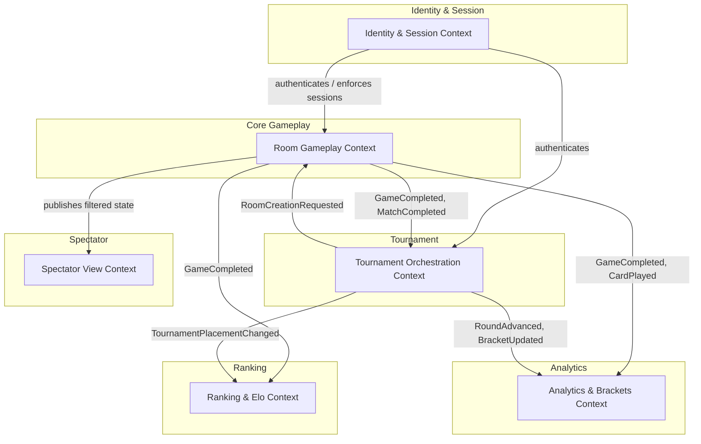

# UnoArena — Domain Model (DDD)

> **Scope:** Behavior-complete domain model for a global real-time Uno platform supporting ad-hoc rooms (2–10 players) and million-player elimination tournaments.  
> **Methodology:** EventStorming-driven Domain-Driven Design.  
> **Constraint:** Domain design only — no infrastructure, deployment, or protocol internals.

---

## Deliverables

| # | Document | Description |
|---|----------|-------------|
| 1 | [Domain Glossary](./01-domain-glossary.md) | Ubiquitous language with precise definitions |
| 2 | [Bounded Contexts & Context Map](./02-bounded-contexts.md) | Context boundaries, relationships, and the Spectator View treatment |
| 3 | [Aggregates, Entities & Value Objects](./03-aggregates.md) | Candidate aggregates, consistency boundaries, and key invariants |
| 4 | [Commands & Domain Events Catalog](./04-commands-events.md) | Core commands, resulting events, causality, and idempotency |
| 5 | [Domain Event Flow Narratives](./05-event-flow-narratives.md) | End-to-end event sequences for key business flows |
| 6 | [Edge Cases & Failure-Path Analysis](./06-edge-cases.md) | Concurrent conflicts, disconnections, stale commands, security abuse |
| 7 | [Consistency & Recovery Strategy](./07-consistency-recovery.md) | Retries, deduplication, compensation/saga decisions at the domain level |
| 8 | [Open Questions & Assumptions](./08-open-questions.md) | Validated requirements vs. assumptions, connection-semantics assumptions |

---

## EventStorming Legend

Throughout the documents we use the following color-coding convention (rendered as labels):

- **🟠 Domain Event** — something that happened (past tense)
- **🔵 Command** — an intention to change state
- **🟡 Policy / Reactor** — automated reaction ("when X happens, do Y")
- **🟣 Aggregate** — consistency boundary that accepts commands and emits events
- **🔴 Hot Spot / Open Question** — unresolved issue or risk
- **🟢 Read Model** — query-optimized projection

---

## EventStorming Big-Picture Board

The following board summarizes the main business flows, exceptional paths, cross-context event propagation, and key policies discovered through EventStorming sessions. Colors follow the legend above.

```
═══════════════════════════════════════════════════════════════════════════════════════════
  ROOM LIFECYCLE (Room Gameplay Context)                          TOURNAMENT LIFECYCLE
═══════════════════════════════════════════════════════════════════════════════════════════

🔵 CreateRoom          🔵 JoinRoom           🔵 StartGame              🔵 CreateTournament
     │                      │                      │                        │
     ▼                      ▼                      ▼                        ▼
🟠 RoomCreated         🟠 PlayerJoined        🟠 GameStarted          🟠 TournamentCreated
     │                                             │
     └──► 🟢 SpectatorRoomView                     ├── 🟡 First Card Rule applied
                                                   │      (action card effect if applicable)
                                                   ▼
                                          ┌─────────────────┐
                                          │  GAMEPLAY LOOP   │
                                          └─────────────────┘
                                                   │
          🔵 PlayCard ◄────────────────────────────┤
               │                                   │
               ▼                                   │
          🟠 CardPlayed ──┬── 🟠 DirectionReversed │       🔵 RegisterPlayer
               │          ├── 🟠 ForcedDraw        │            │
               │          ├── 🟠 TurnSkipped       │            ▼
               │          └── 🟠 UnoCallMade       │       🟠 PlayerRegistered
               │                    │              │
               │                    ▼              │       🔵 StartTournament
               │          🟠 ChallengeWindowOpened │            │
               │                    │              │            ▼
               │           🟡 5s timer             │       🟠 TournamentStarted
               │                    │              │            │
               │                    ▼              │            ▼
               │          🟠 ChallengeWindowClosed │       🟠 RoundStarted
               │                                   │            │
          ┌────┴─── player has 0 cards? ──────┐    │            ▼
          │ No: loop continues                │    │       🟠 RoomCreationRequested
          │ Yes:                               ▼    │       (×N rooms, to Room Gameplay)
          │                              🟠 GameCompleted
          │                                   │
          │              ┌────────────────────┤
          │              │                    │
          │         Casual room          Tournament room
          │              │                    │
          │              ▼                    ▼
          │    🟠 RoomCompleted         🟡 More games?
          │         │                   │          │
          │         ▼                  Yes         No
          │    🟡 UpdateElo             │          │
          │         │               🔵 StartGame  ▼
          │         ▼               (next game)  🟠 MatchCompleted
          │    🟠 EloUpdated                      │
          │    (Ranking ctx)                      ▼
          │                                 🟠 RoomCompleted
          │                                      │
          │                                      ▼
          │                                 🟡 RecordRoomResult
          │                                      │
          │                                      ▼
          │                                 🟠 RoomResultRecorded
          │                                      │
          │                                 🟡 All rooms done?
          │                                 │              │
          │                                 No             Yes
          │                                 │              │
          │                                (wait)          ▼
          │                                          🟠 RoundCompleted
          │                                               │
          │                                          🟡 ≤10 players?
          │                                          │            │
          │                                         No           Yes
          │                                          │            │
          │                                          ▼            ▼
          │                                    🟠 RoundStarted  🟠 FinalRoomCreated
          │                                    (next round)          │
          │                                                          ▼
          │                                                    🟠 TournamentCompleted
          │                                                          │
          │                                                          ▼
          │                                                    🟡 UpdateTournamentPlacement
          │                                                          │
          │                                                          ▼
          │                                                    🟠 TournamentPlacementUpdated
          │                                                    (Ranking ctx)
          │
═══════════════════════════════════════════════════════════════════════════════════════════
  EXCEPTIONAL / FAILURE FLOWS
═══════════════════════════════════════════════════════════════════════════════════════════
          │
          ├── 🔴 Player disconnects
          │        🟠 PlayerDisconnected → 🟡 60s timer
          │        │    On each turn: 🟠 TurnSkipped { reason: disconnection }
          │        │    Timer expires: 🔵 ForfeitPlayer → 🟠 PlayerForfeited
          │        │    Reconnects in time: 🔵 ReconnectPlayer → 🟠 PlayerReconnected
          │
          ├── 🔴 Turn timer expires (connected but inactive)
          │        🟠 TurnTimedOut → 🟡 Auto-draw + pass
          │
          ├── 🔴 Stale command (wrong seq)
          │        → HTTP 409 Conflict + current state → client reconciles via SSE
          │
          ├── 🔴 Session invalidated (new login)
          │        🟠 SessionInvalidated → treated as disconnection in Room Gameplay
          │
          ├── 🔴 Room creation fails (tournament)
          │        🟠 RoomCreationFailed → 🟡 Tournament retries or alerts operator
          │
          └── 🔴 Rate limit exceeded
                   🟠 RateLimitExceeded → HTTP 429 + adaptive throttling
```

---

## High-Level Domain Map (Mermaid)


